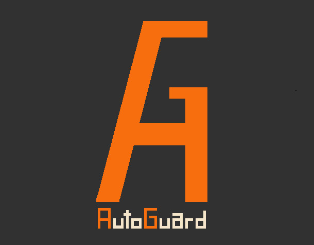
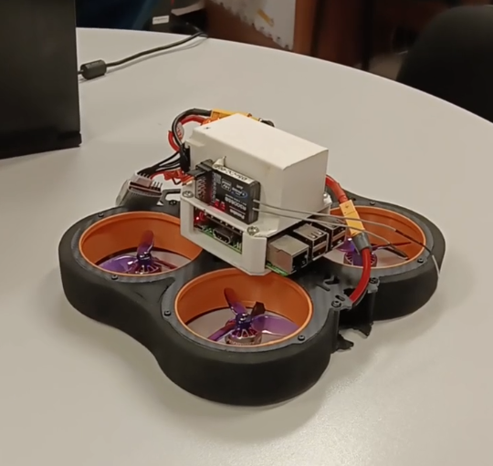
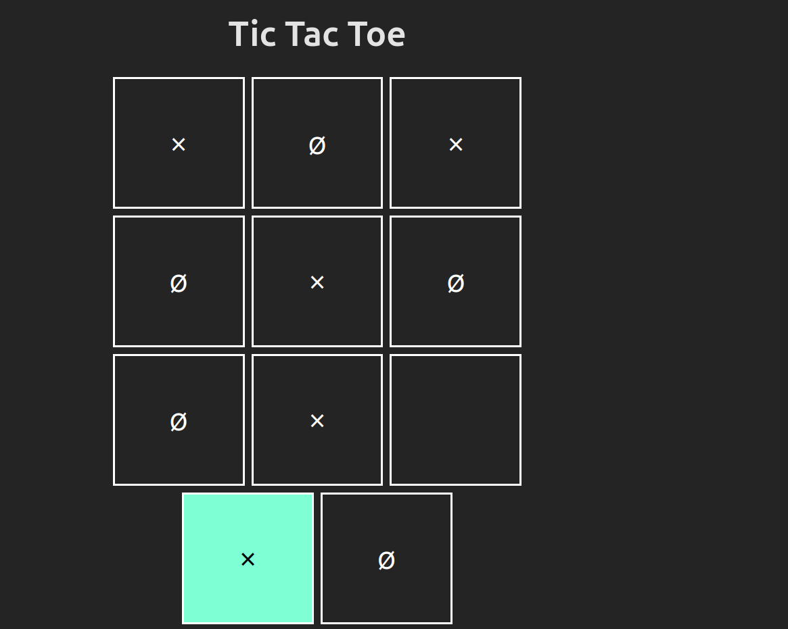

   <h2 align="center">Greetings! I'm Iago 👋</h3>

I'm a <b>Software Engineer</b> with a focus on backend development, although I consider myself a versatile professional with experience across various areas of software development.

- 🌍 **Location**: Spain  
- 💼 **LinkedIn**: [Iago Porto Montes](https://www.linkedin.com/in/iagoportomontes/)  
- 📧 **Email**: iagoportomontes@gmail.com  

---

## 💡 Featured Projects  

  <table>
    <tr>
      <!-- AutoGuard -->
      <td align="center" width="300" valign="top">
        

          
        

        <h3><a href="https://github.com/IagoPorto/AutoGuard">🚘 AutoGuard 🛡️</a></h3>
        
Detects drowsiness and distractions while driving using MediaPipe. Contributes to road safety.

        

          
            
        

      </td>
      <!-- Drone -->
      <td align="center" width="300" valign="top">
        

          
        

        <h3><a href="https://github.com/IagoPorto/Drone-Firefly">🚁 Drone ✨</a></h3>
        
Controlled via Raspberry Pi with PID algorithms, Kalman filtering, and sensors for stabilization.

        

          
            
        

      </td>
      <!-- TicTacToe -->
      <td align="center" width="300" valign="top">
        

          
        

        <h3><a href="https://github.com/IagoPorto/TicTacToe">🎮 TicTacToe 🎮</a></h3>
        
A React implementation of Tic-Tac-Toe with a simple and intuitive two-player design.

        

          
            
        

      </td>
    </tr>
    <tr>
      <!-- Distributed System -->
      <td align="center" width="300" valign="top">
        <h3><a href="https://github.com/IagoPorto/Sistema-Distribuido">🎟️ Distributed System 🚀</a></h3>
        
Distributed system in C using the Ricart-Agrawala algorithm for shared resource management.

        

          
       
        

      </td>
      <!-- E-Commerce -->
      <td align="center" width="300" valign="top">
        <h3><a href="https://github.com/IagoPorto/E-Commerce">📈 E-Commerce 📈</a></h3>
        
Built with MEAN stack (MongoDB, Express.js, Angular, Node.js) including CRUD functionality.

        

          
         
        

      </td>
      <!-- Reversi -->
      <td align="center" width="300" valign="top">
        <h3><a href="https://github.com/IagoPorto/Reversi">🎲 Reversi 🎲</a></h3>
        
An Android Reversi game with an AI powered by the alpha-beta pruning algorithm.

        

          
            
        

      </td>
    </tr>
  </table>

---

## 🛠️  Technologies & Tools  

- **Languages**: Java, C, JavaScript  
- **Frameworks**: Spring, React, Node.js  
- **Databases**: SQL, MongoDB  
- **Architecture**: Clean Code, SOLID principles, Hexagonal Architecture, Domain-Driven Design (DDD)  
- **Messaging & Cloud**: RabbitMQ, AWS  
- **Other Skills**: Android app development, artificial intelligence algorithms, distributed systems  
- **Soft Skills**: Effective communication, team player, fast learner  

---

## 💬 Get in Touch  

I'm open to new opportunities and collaborations on exciting projects. Feel free to reach out via email.  

Thanks for visiting my profile!
